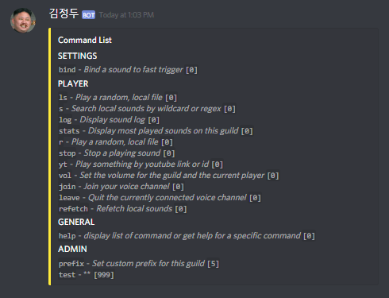
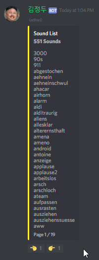
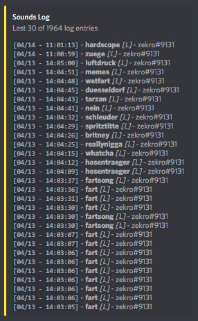
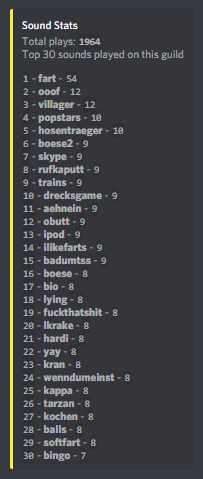

<div align="center">
     
     <h1>~ Yuri v.2 ~</h1>
     <strong>Faster, harder, louder!<br/>The best Discord sound board in whole North Korea!</strong><br><br>
     &nbsp;
     &nbsp;
     &nbsp;
     <a href="https://zekro.de/discord"></a>&nbsp;
     <a href="https://cloud.docker.com/u/zekro/repository/docker/zekro/yuri2"></a>
     <!-- <br>
     <br>
     <a href="https://travis-ci.org/zekroTJA/yuri" ></a>&nbsp;
     <a href="https://github.com/zekroTJA/yuri/releases"></a>
-->
</div>

---

# Index

- [Intro](#intro)
- [Screen Shots](#screen-shots)
- [Setup](#setup)
- [Compiling](#compiling)
- [Used 3rd Party Dependencies](#used-3rd-party-dependencies)

---

# Intro

Yuri is the best Discord sound board in whole North Korea, if you believe it or not! And now, even better with v.2 with way better performance, better code structure, easier installation and a brand new web interface! Also, now, Lavalink is completely implemented as Discord voice backend. With the new, open REST and Web Socket API you are now able to create applications hooking up the Yuri back end!

# Screen Shots

## Discord Front End

<br/>




## Web Interface


---

# Setup

## Runtime Requirements

- [**Lavalink**](https://github.com/Frederikam/Lavalink)  
  Lavalink is a stand-alone Discord Voice backend which is used by Yuri for playing sounds in Discord voice Channels.  
  You need to download the [Lavalink.jar](https://github.com/Frederikam/Lavalink/releases) and run it with a custom config. An example for this you can find [here](config/lavalink/application.yml).
- [**pm2**](https://github.com/Unitech/pm2) or [**screen**](https://wiki.ubuntuusers.de/Screen/) *(or something else liek this)*  
  You will need a software to deamonize the Lavalink and Yuri instance. In this setup tutorial, I will use pm2. You can also use screen or something else you want to use.

## How To

1. Download the [precompiled assets](https://github.com/zekroTJA/yuri2/releases) or [compile them yourself](#compiling). Then, place the binary **with the `web` folder in the same location** somewhere you want.

2. Download, configure and run Lavalink.

3. Start the Yuri binary for the first time. Then, an example config will be created where you need to enter your preferences and credentials for the Discord API and Lavalink connection.

4. Restart the bot using the created config file.


---

# Compiling

## Requirements

- [go compiler toolchain](https://golang.org/dl/)
- [gcc compiler toolchain](https://gcc.gnu.org/releases.html)  
  *For windows you can use [TDM-GCC](http://tdm-gcc.tdragon.net/download)*
- [dep dependency manager](https://github.com/golang/dep)
- *optional:* [GNU make](https://www.gnu.org/software/make/)  
  *For windows see [here](http://gnuwin32.sourceforge.net/packages/make.htm)*

1. Clone the repository to your gopath:
   ```
   $ git clone https://github.com/zekroTJA/yuri2 --depth 5 --branch master
   ```

2. Now you can simply use the make file which will download and install all needed dependencies and compile the binary:  
   ```
   $ make
   ```
   Optionally, you can use the `./scripts/build.sh` script to ensure dependencies and compile binaries.

3. Now, grab the binary located in `./bin` and the `./web` folder and follow the [setup steps](#setup).

---

# Used 3rd Party Dependencies

## Frontend

| Dependency | Licence |
|------------|---------|
| [Bootstrap 4](https://github.com/twbs/bootstrap) | [MIT](https://github.com/twbs/bootstrap/blob/master/LICENSE) |

## Backend

| Dependency | Licence |
|------------|---------|
| [my fork](https://github.com/zekroTJA/discordgo) of [bwmarrin/discordgo](https://github.com/bwmarrin/discordgo) | [BSD-3-Clause](https://github.com/bwmarrin/discordgo/blob/master/LICENSE) |
| [foxbot/gavalink](https://github.com/foxbot/gavalink/) | [ISC](https://github.com/foxbot/gavalink/blob/master/LICENSE.md) |
| [mattn/go-sqlite3](https://github.com/mattn/go-sqlite3) | [MIT](https://github.com/mattn/go-sqlite3/blob/master/LICENSE) |
| [ghodss/yaml](https://github.com/ghodss/yaml) | [MIT](https://github.com/ghodss/yaml/blob/master/LICENSE) |
| [op/go-logging](https://github.com/op/go-logging) | [BSD-3-Clause](https://github.com/op/go-logging/blob/master/LICENSE) |
| [gorilla/websocket](https://github.com/gorilla/websocket) | [BSD-2-Caluse](https://github.com/gorilla/websocket/blob/master/LICENSE) |

---

© 2019 zekro Development (Ringo Hoffmann)  
[zekro.de](https://zekro.de) | contact[at]zekro.de
